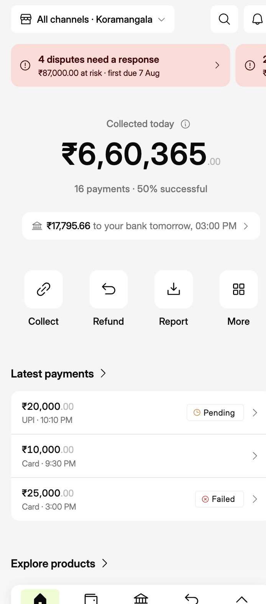
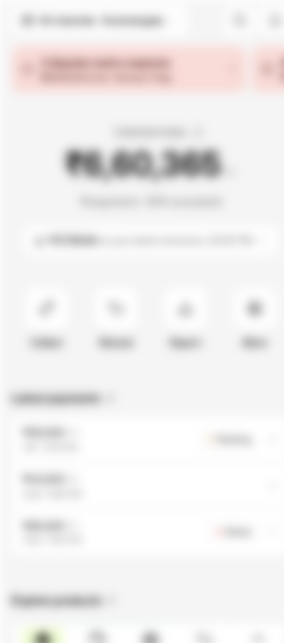
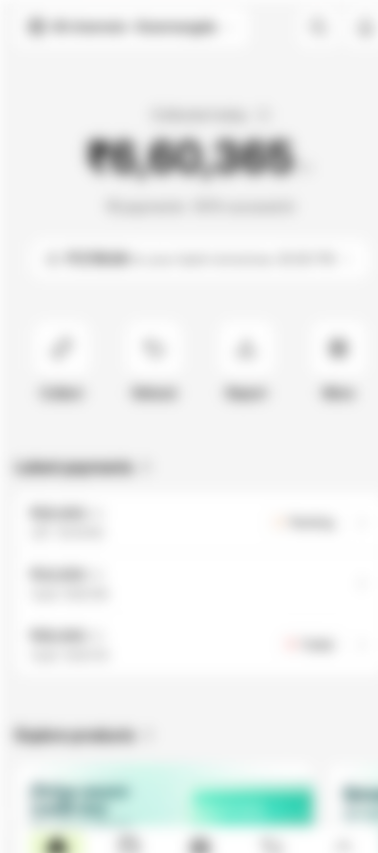
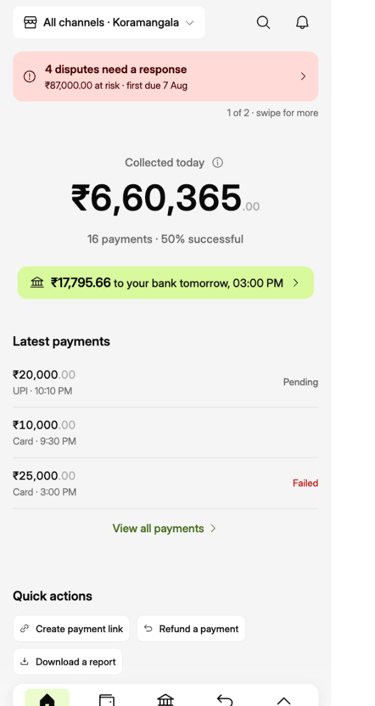
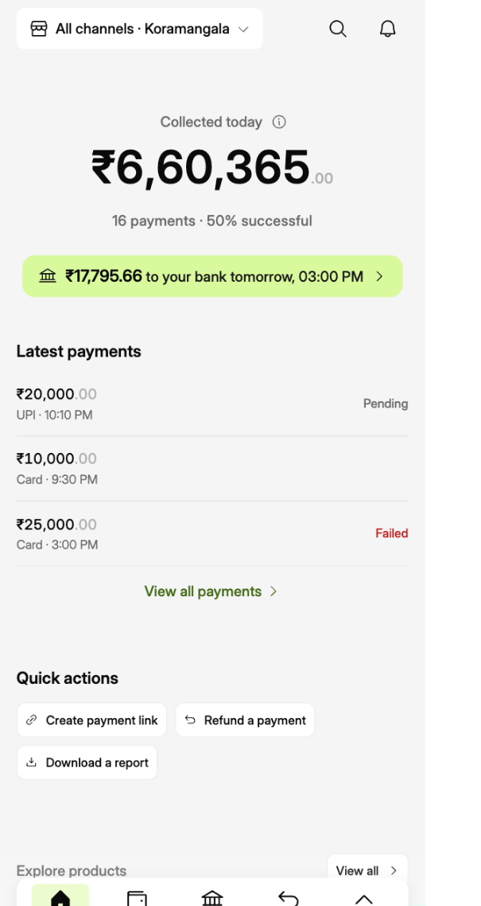
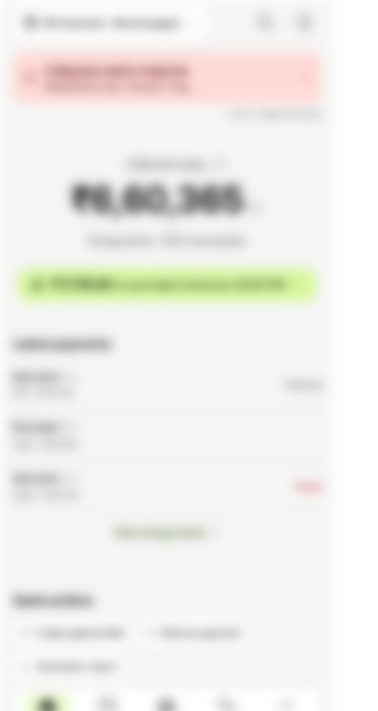
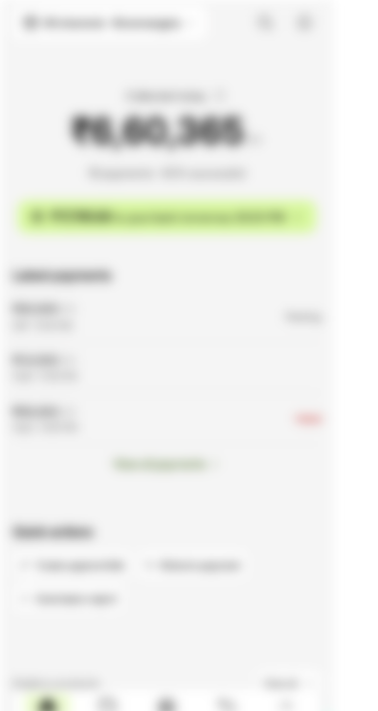

# Mobile Home (Overview): Hierarchy and Spacing Audit

Last updated: 2026-09-29

**Scope:** the mobile Overview as built today (`mobile/src/app/index.tsx`, variant A after the hierarchy revision; see `mobile-home-reference-analysis.md` and decision-log entry 87). Every component on the page was checked: header, alerts, hero, payout pill, actions, Latest payments, Explore products, and the nav bar.

**Question:** does each part follow the intended hierarchy and spacing? Where does attention actually go, compared with what a merchant should see?

**Method**
1. **Intended priority:** what the merchant should see, and in what order, derived from their daily jobs and our design principles (P1–P7 in `design-principles.md`).
2. **Measured render:** real font sizes, weights, colours and families from the running web build (phone viewport). Spacing comes from the code, which is the source of truth.
3. **Squint test:** the page blurred by 7px, so only mass, contrast and colour remain. This approximates where the eye goes before reading. It was run for both states: with alerts, and the happy view (`?view=happy`).
4. **Contrast:** WCAG ratios for the muted text colours.

| | With alerts | Happy view |
|---|---|---|
| Page |  |  |
| Squint (blurred) |  |  |

---

## 1. What the merchant should see, in order

Derived from the daily-check-in merchant in `design-principles.md` §1 (cash-flow anxious, wants fast reassurance, and alarm only when warranted):

| Rank | What | The question it answers | Should read as |
|---|---|---|---|
| **P0** | Money blocked: disputes due, settlements failed or held (**only when true**) | "Is something wrong?" | The first thing seen, and unmistakable. When nothing is wrong, it doesn't exist. |
| **P1** | Collected today | "How's my day?" | **The** hero: the heaviest thing on the page by far |
| **P2** | When the money reaches the bank | "When do I get paid?" | Clearly second, read in the same glance as P1 |
| **C** | Scope: which store or channel | "What am I looking at?" | Always legible, never loud (context, not content) |
| **P3** | Collect · Refund · Report · More | "Let me do my task" | Easy to find, but quieter than P1 and P2 |
| **P4** | Latest payments | "Did that customer's payment go through?" | Reference material, scanned on demand |
| **P5** | Explore products | (Not a merchant job; it's our promotion) | Last. Never competes, and never on the first screen. |

---

## 2. Measured render

### 2.1 Type used on the page

| Element | Size / family | Colour | Notes |
|---|---|---|---|
| Hero amount "₹6,60,365" | **44** / Inter SemiBold | near-black `#0A0A0A` | The only text above 16. A 2.75× jump to the next size, which is good. |
| Hero paise ".00" | 14 / **Roboto** ⚠ | grey at 50% alpha | Wrong font family (see F5). Contrast is 1.9:1. |
| Hero label "Collected today" | 14 / Inter Medium | grey `#737373` | 4.35:1 on the page background, **just below AA** (4.5) |
| Hero context "16 payments · 50% successful" | 14 / Inter Medium | grey | Same as above |
| Pill amount "₹17,795.66" | 14 / Inter Medium | near-black | |
| Pill sentence "to your bank tomorrow…" | 14 / **Roboto** ⚠ | grey | Wrong font family (F5) |
| Alert title | 14 / Inter SemiBold | dark red on pink | |
| Alert detail | 12 / Inter Regular | dark red on pink | |
| Action labels (Collect…) | 14 / Inter Medium | **near-black** | Darker than the hero's own context line (F6) |
| Section titles (Latest payments, Explore products) | 16 / Inter SemiBold | near-black | |
| Payment amounts | 14 / Inter Medium | near-black | |
| Payment meta / status labels | 12 / Inter Regular | grey / near-black | |
| Header switcher | 14 / Inter Medium | near-black | |
| Nav labels | 10 / Inter | near-black | |

That's six sizes (44 / 16 / 14 / 12 / 10, plus 14 paise) and two font families. The scale itself is disciplined; the Roboto leak is a bug.

### 2.2 Spacing, top to bottom

From the code, in dp. The *With alerts* column shows where each element lands on a 390×844 phone (status bar about 47, header row 56).

| Gap | Value | Reads as | Verdict |
|---|---|---|---|
| Header → alerts | 8 | Alerts belong to the top of the page | ✅ |
| Alerts → hero label | **40** (the hero's top padding) | A clear break: alarm, then the day | ✅ |
| Label → amount → context line | 4 · 4 | One unit | ✅ Tight grouping, as in the references |
| Context line → payout pill | 24 | Still part of the hero | ✅ The pill groups with the hero (24 < 40) |
| Pill → actions | **40** | A new block | ✅ |
| Actions → Latest payments | **48** | A new section | ✅ |
| Latest title → list | 12 | Title owns the list | ✅ |
| Latest payments → Explore products | **48** | "Same importance as Latest payments" | ⚠ Equal gaps signal equal importance, but P5 sits well below P4 (F4) |

**Share of the first screen:** the hero block (label to pill, plus its padding) is about 250dp of roughly 650dp of usable height, about **38%**. That's in line with Mercury (about 40%). The space is right; the problem is what competes inside the rest of the screen.

### 2.3 Surfaces and colour on the first screen

- **White blocks:** 10 of them. Switcher, search, bell, payout pill, 4 action tiles, the Latest payments card and the nav bar. They're all the same white on the same grey, with no elevation difference, so they read as equal.
- **Saturated colour** (what the eye jumps to):
  - With alerts: pink alert fill ×2 (one peeking in at the right edge), the orange "Pending" icon, the red "Failed" icon, and the lime active nav tab.
  - Happy view: the orange and red status icons, the lime nav tab, and the **teal product banner** (it enters the first screen on taller phones and the web preview).
- **Brand colour (lime)** appears only on the active nav tab, never on the hero or its line.

---

## 3. Where attention goes vs where it should

Visual weight ranked from the squint test plus the measurements above (size × contrast × saturation × position):

### With alerts

| Rank | Actually gets attention | Should be | Match |
|---|---|---|---|
| 1 | Alert row: pink fill at the top, with a second card peeking at the right edge | P0 | ✅ Right element, but the peek pulls the eye to the edge (F3) |
| 2 | Hero amount | P1 | ✅ |
| 3 | **Latest payments card**: the largest white area, plus orange and red status icons | P4 | ❌ **Two ranks too high** (F2) |
| 4 | Action tiles: four repeated white squares with near-black labels | P3 | ≈ Slightly heavy (F6) |
| 5 | Header: three white tiles and near-black switcher text | C | ≈ A little loud for context (F7) |
| 6 | **Payout pill**: white on grey, mostly grey text, nearly gone when blurred | **P2** | ❌ **Four ranks too low** (F1) |
| 7 | Lime active nav tab | (chrome) | ⚠ The only brand colour on the page is in the chrome (F8) |

### Happy view

| Rank | Actually gets attention | Should be | Match |
|---|---|---|---|
| 1 | Hero amount | P1 | ✅ It now clearly owns the page |
| 2 | **Teal product banner** at the bottom edge (saturated image) | **P5** | ❌ **The promotion is the second-strongest thing on a calm day** (F4) |
| 3 | Latest payments card + coloured status icons | P4 | ❌ (F2) |
| 4 | Action tiles | P3 | ≈ |
| 5 | Header tiles | C | ≈ |
| 6 | Payout pill | **P2** | ❌ (F1) |

**Summary:** the hero now wins, and alerts win when they should. The **second tier is upside down**. The payout line, which should come second, is among the weakest things on the page, while two low-priority blocks (Latest payments, and Explore products in the happy view) take the second-strongest positions.

---

## 4. Findings

Severity: **High** breaks the P0–P5 order · **Medium** divides attention or breaks a principle · **Low** polish.

### F1. The payout line is too weak for second place (High)
- **Evidence:** a white pill on a light grey page (a low-contrast edge), with most of the sentence in grey 14. In the squint test it almost disappears. It's also visually the same object as the header tiles and action tiles.
- **Why it matters:** "When do I get paid?" is a merchant's sharpest anxiety (merchant-homepage §2.2). Today it reads like a footnote.
- **Fix:**
  - Give it the page's single **brand-tinted fill** (lime `secondaryContainer`, as the active nav tab uses) so it's the one coloured object after the hero.
  - Set the whole sentence in `onSurface`.
  - Lift the amount to 16 SemiBold.
  - Keep it 24dp under the hero so it stays in the hero group.

### F2. Latest payments outweighs the actions and the payout (High)
- **Evidence:** it's the largest white container on screen (about 380×190). Two status icons (orange and red) are the most saturated marks below the fold line. It has a card, dividers and chevrons: a lot of structure for reference material.
- **Fix** (follow Mercury's lists):
  - Drop the card: plain rows on the page background, with hairline dividers.
  - Show "Pending" as grey text, not an orange-iconed pill.
  - Keep red for "Failed" only, as plain red text with no pill.
  - Drop the per-row chevrons; the whole row is tappable.

### F3. The second alert peeking at the right edge pulls the eye sideways (Medium)
- **Evidence:** the first alert is about 330dp wide and the second peeks about 40dp of pink at the screen edge. Saturated colour at a boundary is a strong attractor, and it competes with reading the first alert. The two alerts also look identical, although one is a deadline (disputes) and one is money held (settlements).
- **Fix:** choose one of these (the user's call):
  - (a) A single alert card, "2 things need your attention", with both items as lines inside it, so there's no peek.
  - (b) Keep the sideways row, but make the second card fully off-screen with a "1 of 2" counter.

  Either way, keep pink for P0 only. Separately, the settlements alert's ₹45,46,200 is a mock-data artefact (every failed or held batch ever); real data needs a "currently held" field.

### F4. Explore products has equal spacing and the strongest colour on calm days (High in the happy view)
- **Evidence:** a 48dp gap, the same as between the actions and Latest payments. A saturated teal image, which in the happy view reaches the first screen on taller phones. It's P5, and it's marketing.
- **Fix:**
  - Push it further down, with a 72dp break and a quiet caption-style heading ("For your business").
  - Make sure it never enters the first screen: a minimum top offset, or render it only after the list.
  - Consider a single-line text row ("Explore GrowthHub, SmartBill… ›") instead of image banners, or show one banner at a time.

### F5. Roboto leaks into the hero (Medium, a bug)
- **Evidence:** ".00" and the pill's "to your bank tomorrow, 03:00 PM" render in **Roboto**, while everything else is Inter Display. On iOS, where Roboto isn't installed, they fall back to San Francisco.
- **Cause:** nested `<Text>` without a `variant` takes Paper's `fonts.default`, which `constants/paper-theme.ts` never sets to Inter. It affects every nested text in the app, not just home.
- **Fix:** set `fonts.default` (the family and regular weight) to Inter Display in `paper-theme.ts`. This is a one-line, app-wide fix.

### F6. The action labels are darker than the hero's own context line (Medium)
- **Evidence:** "Collect / Refund / Report / More" are near-black 14 Medium. The hero's "16 payments · 50% successful" is grey 14 Medium. The verbs therefore out-contrast the hero's supporting line, and four white 56dp tiles repeat a strong shape.
- **Fix:**
  - Set the action labels to `onSurfaceVariant` at 12–13.
  - Keep the icons near-black, since the icon is the affordance.
  - Optionally give the tiles a lower-contrast fill (`surfaceVariant`) so they sit behind the hero.

### F7. The header is a little loud for context (Low)
- **Evidence:** three white tiles (switcher, search, bell) at the very top, in the prime reading position, above the alerts.
- **Fix:**
  - Keep the switcher as the only filled control.
  - Make search and the bell icon-only (transparent at rest).
  - This is a global header change, so apply it to all pages for consistency.

### F8. Brand colour is only in the chrome (Low)
- **Evidence:** lime appears only on the active nav tab, so the one brand-coloured thing on the page is navigation.
- **Fix:** covered by F1. Using lime on the payout pill puts the brand colour on content, at P2.

### F9. The muted text is just under AA contrast (Medium, accessibility)
- **Evidence:** grey `#737373` on the page grey `#F5F5F5` is **4.35:1**. The minimum for 14px text is 4.5:1. That affects the hero label and the context line. The dimmed paise are **1.9:1**.
- **Fix:**
  - Darken the muted text on the page background to about `#6B6B6B` (4.9:1), or render these lines at 16.
  - Paise at 1.9:1 are acceptable as decoration only where the amount is never ambiguous without them. On the payout amount (₹17,795.66) the paise matter, so show them at full muted colour there.

### F10. The paise are small and sit on the baseline (Low)
- **Evidence:** 14px against 44px (32%), on the baseline. Mercury uses about 50% size, raised as a superscript, so the amount reads as one shape.
- **Fix (optional):** 20px paise, top-aligned, for the display size only.

---

## 5. What's already working

- **A single focal number.** At 44pt it's the only text above 16. The hero is unmistakably the hero, especially in the happy view.
- **Proximity grouping.** Label, amount and context line sit 4dp apart, the pill 24dp away, and the next block 40dp away. The eye reads "one thing".
- **Alarms only when warranted.** In the happy view there's no banner at all, and nothing red above the fold.
- **Space budget.** The hero takes about 38% of the first screen, in line with the references.
- **The type scale.** Six sizes with clear roles, and no stray sizes.

---

## 6. Recommended changes, in order

| # | Change | Fixes | Effort |
|---|---|---|---|
| 1 | Set Paper `fonts.default` to Inter Display | F5 (app-wide) | Trivial |
| 2 | Payout pill: lime tint, full-contrast sentence, 16 SemiBold amount | F1, F8 | Small |
| 3 | Latest payments: no card, plain rows, grey "Pending", red text only for "Failed" | F2 | Small |
| 4 | Explore products: 72dp break, quiet heading, never in the first screen | F4 | Small |
| 5 | Action labels muted, 12–13 | F6 | Trivial |
| 6 | Darken the muted text on the page background to about `#6B6B6B` | F9 | Trivial (a theme token) |
| 7 | Alerts: one combined card, or a "1 of 2" counter, instead of the peek | F3 | Small, **needs your call** |
| 8 | Header: search and bell icon-only | F7 | Small, applies to all pages |
| 9 | Paise at about 50% size, raised, on the hero | F10 | Optional |

**Expected result**, re-checked with the same squint test after the changes:
- **With alerts:** Alert → Amount → Payout → Actions → Latest → (Explore off-screen).
- **Happy view:** Amount → Payout → Actions → Latest.

That's the P0–P5 order from §1.

---

## 7. Quick actions: why they feel random, and the ways to handle them

*Added 2026-09-29. Layout change made the same day: Latest payments now sits directly under the hero (it's what "collected today" is made of), and quick actions come after it. The list ends with a "View all payments" button instead of a clickable title.*

### 7.1 Why the current four feel random

| Problem | Evidence |
|---|---|
| **Four different kinds of thing in one row** | *Collect* creates something (a payment link). *Refund* is a find-then-act flow, but it only opens a list. *Report* is a utility. *More* is navigation, and duplicates the nav bar's own More. The eye expects a row of siblings and gets four unrelated concepts. |
| **Verbs without objects** | Collect *what*, and *how* (link, QR)? Report *which* report? A one-word label only works when the object is obvious; here it isn't. |
| **The label promises more than the tap delivers** | "Refund" lands on the Payments list with the search focused. The merchant expected to start a refund. |
| **Same weight, different frequency** | Collecting might happen several times a day for an online merchant. A refund is occasional, a report is end-of-day, and More is rare. Identical tiles say they're all equally common. |
| **Icons that don't carry meaning** | The refund icon (a curved arrow) reads as "back/undo". The More icon (a 2×2 grid) reads as "apps". |

### 7.2 The merchant's everyday jobs (what the actions are for)

| Job | Frequency | Already covered elsewhere on home? |
|---|---|---|
| Take a payment remotely (payment link, or a QR code at the counter) | Daily, many times for online merchants | No |
| Refund a customer | Occasional, always about **one specific payment** | Partly: Latest payments rows lead to the transaction, whose detail page has Refund |
| Get today's report, or reconcile the day | End of day, daily | No |
| Check when money lands | Daily | **Yes**: the payout pill |
| Respond to a dispute | Exception | **Yes**: the alert row |
| Add a device, invite a user | Rare (setup) | Not a home job, and More or the nav reaches it |

### 7.3 Ways to handle quick actions

Existing components we can use:
- **M3 floating Toolbar** (`material3/toolbar.tsx`)
- **FAB and FAB menu** (Paper; see the FABMenu story)
- **Split button** (`material3/split-button.tsx`)
- **Outlined action chips**: `OutlinedActionButton`, the same row used under search on every listing page
- **List rows**: `ListRow`

(`ButtonGroup` is for picking one option, not for actions.)

| Option | What it looks like | Understandable? | Hierarchy fit | Consistency | Trade-off |
|---|---|---|---|---|---|
| **A. Fix the icon grid** | Keep 4 tiles, but with verb+object labels: "Payment link", "Refund", "Today's report", and a real 4th action (e.g. "QR code") instead of More | ◐ Better labels, still a grid of mixed jobs | ◐ Tiles stay heavy (audit F6) | ◐ | Smallest change; the root problem (mixed kinds) remains |
| **B. Contextual actions** | Each action sits next to what it acts on. **Refund** on each payment (the row, or the transaction's detail footer). **Download today's report** next to the hero. **Collect** as the page's primary action. | ● The object is right there | ● No separate action block to compete | ● Matches the inner-page rule "CTA belongs to its content" | Actions are less discoverable as a set |
| **C. One primary + overflow** | An extended FAB, "Collect payment", above the nav, opening Payment link / QR code (FAB menu). Everything else contextual (B). | ● One obvious main job | ◐ The FAB floats over content and must hide with the nav on scroll | ◐ New pattern on home | Strong for collection-heavy merchants; the FAB can cover the last list row |
| **D. Labelled action chips** | A "Quick actions" row of outlined chips with full labels: **Create payment link · Refund a payment · Download today's report** (sideways scroll). No More. | ● Full sentences | ● Light: quieter than the hero and the list, as P3 should be | ● **The same row every listing page already has under search** | Chips are smaller touch targets than tiles (still 36–40dp) |
| **E. Task rows** | A short list: icon + title + one-line hint, e.g. "Create a payment link: send by SMS or WhatsApp", "Refund a payment: pick it from your payments" | ●● Self-explaining | ◐ Takes vertical space | ◐ | Best for new merchants; heavy for daily users |
| **F. Split button** | "Collect payment" with a ▾ for link / QR / invoice | ● | ● | ◐ | Only solves Collect; pair it with B or D |
| **G. Adaptive / most-used** | The order changes with usage | ○ Moves under the user's thumb | ● | ○ | Breaks P7 (familiarity is functional); not recommended |

### 7.4 Recommendation

**D + B.** Under Latest payments, a "Quick actions" row of labelled chips (**Create payment link · Refund a payment · Download today's report**), built from the same chip row every listing page uses. Drop More, since the nav bar already has it. Alongside that, make **Refund** honest: the chip opens Payments with the search focused **and** a hint line ("Pick the payment to refund"), filtered to successful payments.

Why this combination:
- Full labels remove the guesswork.
- The chips are lighter than tiles, so they sit at P3 as the hierarchy needs.
- The pattern is the one merchants already know from every other page.

If you'd rather make collecting the obvious main job, add **C** (a "Collect payment" FAB menu) on top of it.

---

## 8. Applied (2026-09-29)

User: "go ahead and make the changes, go for your recommended way for quick actions".

| # | Change | Where |
|---|---|---|
| F5 | Paper `fonts.default` is now Inter Display, so there's no Roboto or San Francisco in nested text anywhere in the app. The paise take the amount's own family. | `constants/paper-theme.ts`, `shared/amount.tsx` |
| F9 | Muted text `onSurfaceVariant` changed from `#737373` to `#6b6b6b` (4.9:1 on the page), app-wide | `constants/paper-theme.ts` |
| F1, F8 | Payout pill: lime `secondaryContainer`, the sentence in full contrast, the amount at 16 SemiBold | `overview/sales-hero.tsx` |
| F2 | Latest payments: no card; plain rows with hairlines; no chevrons; "Pending" as grey text; only "Failed" in red; the list ends with the "View all payments" button | `overview/latest-payments.tsx` |
| F4 | Explore products: a quieter heading (muted labelLarge) and a 72dp break before it; it no longer reaches the first screen | `overview/explore-products.tsx`, `app/index.tsx` |
| F3 | Alerts: full-width cards one at a time (a 16dp gap, so nothing peeks) with an "N of M · swipe for more" counter; the sideways "scroll version" is kept (user decision) | `overview/attention-strip.tsx` |
| F7 | Overview header: search and the bell are icon-only (`HeaderControl quiet`), so the switcher is the header's one box | `page-header.tsx`, `app-tabs.tsx` |
| F6, §7 | Quick actions, option D: a "Quick actions" section of labelled chips (**Create payment link · Refund a payment · Download a report**), wrapping so all three stay visible; More removed. *Refund a payment* opens Payments on successful payments, with the search focused and a "Pick the payment to refund. Showing successful payments. · Show all" hint. | `overview/quick-actions.tsx`, `payments/transactions-view.tsx` |
| F10 | Not done (optional): paise at about 50% size, raised | — |

"Download today's report" became **Download a report**. The report sheet doesn't preset a date range yet, so the label says only what the button actually does.

**Re-check (same squint test):**
- With alerts: Alert → Amount → Payout pill → Latest payments → Quick actions. Explore products is off the first screen.
- Happy view: Amount → Payout pill → Latest payments → Quick actions.

This matches the P0–P5 order in §1.

| | With alerts | Happy view |
|---|---|---|
| Page |  |  |
| Squint |  |  |
