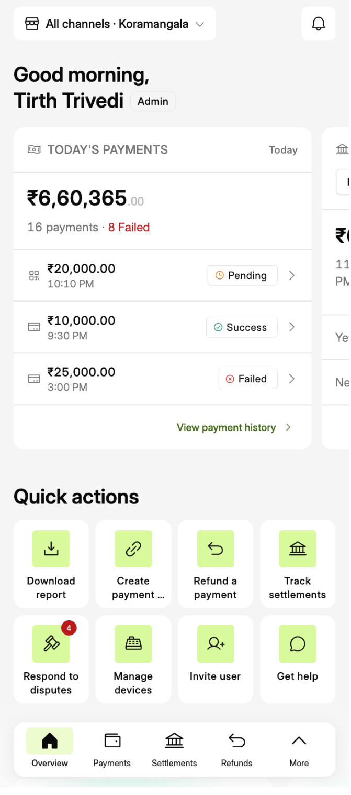

# Mobile Home (Overview): What We Can Borrow from Mercury and Revolut

Last updated: 2026-09-29

**Inputs**
- Reference screens: Figma `PineOne---Omni-channel`, section *Header structure* (node `6254:20`). Mercury home: `6254:6` and `6254:8`. Revolut Business home: `6254:14`. The other frames there (Transactions, Accounts, Departments, Analytics, Select role) are inner pages, used here only as supporting evidence.
- Our screen today: `mobile/src/app/index.tsx` (Overview). Screenshots: `assets/mobile-home/overview-today-top.png`, `assets/mobile-home/overview-today-scrolled.png`.
- Rules we already agreed: `docs/design/design-principles.md` (principles P1–P7) and `docs/flows/merchant-homepage.md` (needs-attention surface, business snapshot).

**The question:** the references feel calm because one amount dominates and the screen has room to breathe, while our Overview feels cluttered. What exactly makes the difference, how does it map onto our data, and which patterns would help a merchant in their day-to-day work?

---

## 1. Anatomy of the reference home screens

### Mercury (6254:8, and 6254:6 scrolled)

| Zone | What's there | Notes |
|---|---|---|
| Header | Org tile + "Mobbin ⌄" switcher on the left, avatar on the right | Nothing else. Once scrolled it stays as the only chrome (6254:6). |
| Hero label | "Mercury balance ⓘ" | One plain label; the ⓘ explains what the number means. |
| Hero number | **$0.00**, very large, decimals superscripted and smaller | The only large thing on screen. |
| Context line | "30D ▾ · ↗ $0.00 · ↘ $0.00" | The period control and money in / money out, all in **one line** under the hero. The period is changed right where it's read. |
| Space | About 40% of the first screen is empty | The whitespace *is* the grouping. There are no card borders around the hero. |
| Next section | A hairline divider, then "August 2025 ›" | The section title is itself the link. No "View all" button, no card footer. |
| Scrolled (6254:6) | "Money in / Money spent" as a two-column pair, then "Cards ›" | Supporting numbers come in pairs at a medium size, well below the hero. |

### Revolut Business (6254:14)

| Zone | What's there | Notes |
|---|---|---|
| Header | Avatar, **search pill**, analytics icon | Search is a first-class entry point on home. |
| Hero label | Flag + "Main · SGD" | Says *which* balance this is (scope). |
| Hero number | **S$9.14**, very large, smaller decimals, centred | |
| Hero context | "Default", then an "Accounts" pill, then pager dots | Swipe sideways between balances of the **same shape** (one per account). |
| Primary verbs | Four round icon buttons with one-word labels: Add money · Move · Details · More | Exactly four, plus "More" as the overflow. One-word labels never truncate. |
| Below | Latest transactions in one card | Activity comes *after* the verbs, and each row is plain (no chips). |

### What both do (the common patterns)

1. **One hero number.** One large figure answers "how am I doing?"; everything else is at least two type steps smaller.
2. **A label says what the number is.** "Mercury balance", "Main · SGD": short, plain, with scope where it matters.
3. **Decimals are de-emphasised.** The integer part is what people scan.
4. **One context line, not a card.** The period, direction (↗ in, ↘ out) and secondary figures fit in one line.
5. **Whitespace instead of containers.** The hero has no card, border or header strip, and the space around it groups it.
6. **Few verbs, high up.** Revolut has four round actions with one-word labels. Mercury pushes actions to inner screens.
7. **Section titles are links** ("August 2025 ›", "Cards ›"), which removes "View all" buttons and card footers.
8. **Detail lives one tap away.** Neither home screen shows statuses, chips, or three-line rows above the fold.

---

## 2. Our Overview today: why it feels cluttered



**Inventory of the first screen** (All channels · Koramangala):

- **Header:** switcher and bell.
- **Greeting:** "Good morning," on one line, then "Tirth Trivedi" plus an "Admin" badge (two lines of 24pt).
- **Today's payments card:** an icon, an uppercase "TODAY'S PAYMENTS" label and a "Today" tag, a divider, then **₹6,60,365**. Under that, "16 payments · **8 Failed**" in red, a divider, then 3 payment rows (each with a mode icon, amount, time, status pill and chevron), a divider, and "View payment history ›".
- **Today's settlement card:** peeks in from the right as a second hero. It holds a Pine Labs / Partner Bank toggle, **₹62,753**, "110 payments · Last settlement Today · 03:00 PM", "Yet to settle ₹17,795" and "Next settlement Tomorrow · 03:00 PM".
- **Quick actions:** 8 lime tiles in two rows of 4. Labels wrap to two lines, and one is truncated ("Create payment …"). "Respond to disputes" has a red **4** badge.
- **Nav bar:** 5 items.
- **Below the fold:** "Explore products" with "View all" and marketing banners.

On one screen that's **about 45 separate elements**. There are **two competing hero amounts** (one half off-screen), **six currency figures**, **four status colours** (orange, green, red text, red badge), **five dividers**, and **eight identical accent tiles**.

### Diagnosis against our own principles

| # | Problem | What causes it | Principle broken |
|---|---|---|---|
| D1 | There's no single answer to "how's my day?" | Two hero amounts in a carousel, the second only half visible. The eye has to choose. | P1 (answer first), P6 (size means the same thing) |
| D2 | Alarm is used for something that isn't blocking money | "8 Failed" in red on the main card. Failed payments are customers' failed attempts, not the merchant's money being held. | P2 (quiet by default) |
| D3 | The real alarms are buried | Disputes needing a response (4) show only as a small badge on a tile, and failed or on-hold settlements (20 failed on the Settlements page) don't appear at all. | P1, P2, and merchant-homepage §1 (needs-attention surface), which the mobile Overview doesn't have yet |
| D4 | List detail appears on the home screen | 3 recent-payment rows with chips and chevrons. That's the Payments tab's job. | Pattern 8 above; the snapshot in merchant-homepage §2.4 is "headline number only" |
| D5 | Card chrome doubles the noise | An icon, an uppercase label, a "Today" range tag, dividers and a footer link, around every block. | P7 (familiarity) is kept, but the density is wrong (policy §2, test 2) |
| D6 | Too many actions, and half of them copy the nav bar | Track settlements, Refund a payment (it only opens Payments), Manage devices and Respond to disputes are navigation, not actions. Eight equal tiles also mean none of them stands out. | Pattern 6 above |
| D7 | Reports shows up on home | The "Download report" tile. | merchant-homepage §3 ("no homepage touchpoint") |
| D8 | The greeting takes the prime spot | Two lines of 24pt plus a role badge sit above the numbers, and the role badge tells a merchant nothing new each day. | P1 |
| D9 | Marketing competes with daily work | "Explore products" banners on the daily screen. | P2 (quiet by default) |

---

## 3. Mapping the patterns onto our data

### 3.1 What is our "balance"?

A merchant using Pine One doesn't hold a balance with us, so there's no single "balance" figure. There are two candidates, and each answers a different daily question:

| Candidate hero | Answers | Our data | Case for it | Case against |
|---|---|---|---|---|
| **Collected today** (₹6,60,365) | "How much did I sell today?" | `TODAY_PAYMENTS.totalAmount`, scaled by the scope | It's what a shopkeeper checks during and at the end of the day, it moves in real time, and it matches Revolut's "money in the account" feeling | The amount isn't in the bank yet, and on its own it can't say whether it's a good day (P3) |
| **Money on its way to you** (₹17,795 settling tomorrow at 3 PM) | "When do I actually get paid?" | `SETTLEMENT_TODAY.pendingAmount` + `nextSettlement` | This is Mercury's true "balance" analogue, and merchant-homepage §2.2 already says payout anxiety comes first ("Settlements leads") | It changes once a day, so it's less alive, and it's the smaller number |

**Recommendation:** make **Collected today** the hero, and make settlement the **one context line under it**, so both questions are answered in one glance without a carousel:

```
Collected today ⓘ
₹6,60,365.00
16 payments  ·  ₹17,795 reaches your bank tomorrow, 3 PM ›
```

This departs from merchant-homepage §2.2 ("Settlements leads"). It keeps settlement in the first glance, just as the qualifier rather than the headline. **This needs your call.** If you prefer payout-first, flip the two (see variant B in §5).

### 3.2 Where each data point goes

| Data point today | Keep? | New home |
|---|---|---|
| Greeting + name | Shrink | One small line above the hero ("Good morning, Tirth"), or drop it. The role badge moves to Account settings. |
| Store / channel switcher | Keep | Header, left (done). |
| Collected today | **Hero** | Large, decimals dimmed (we already have `DimmedDecimalAmount`). |
| Payment count | Keep | Context line: "16 payments". |
| Failed count (8) | Demote | Not red on home. Either a neutral "94% success" in the context line (merchant-homepage §2.4 allows a delta on success rate only), or dropped, since it's visible on Payments. |
| Last 3 payments | Move down | A plain "Latest payments ›" list *below* the actions (as Revolut does): amount, time and mode only, with no status chip unless the payment failed. Or drop it from home. |
| Settlement source toggle (Pine Labs / Partner Bank) | Move | Settlements page. It's a reconciliation detail, not a daily glance. |
| Net settled today (₹62,753), 110 payments, last settlement time | Move | A "Settled today ₹62,753 ›" row in the snapshot, or the Settlements page. |
| Yet to settle + next settlement | **Context line** | "₹17,795 reaches your bank tomorrow, 3 PM ›". |
| Disputes needing a response (4) | **Promote** | Needs-attention strip (merchant-homepage §1): "4 disputes need a response · ₹X at risk ›". Shown only when there's something to do. |
| Failed / on-hold settlements | **Add** | The same strip: "20 settlements failed · ₹X held ›". |
| Quick actions (8) | Cut to 4 | Round verbs (see §4, pattern 6). |
| Explore products | Move | Below everything, one dismissible banner, or into the More sheet. |

### 3.3 Data we don't have yet (needed for some patterns)

- **"Normal for me" baseline (P4):** the same weekday's average over the last 4 weeks, to say "Busier than a usual Tuesday" instead of showing a percentage.
- **Success rate** as its own field (today we only have `failedCount`).
- **Amount at risk** for disputes and held settlements, aggregated for the attention strip.
- **Device health** (terminal offline, low paper): a real in-store daily blocker, currently not in the data.

---

## 4. Pattern library: what to borrow, and how it helps a merchant

| # | Pattern (source) | How it would look for us | Merchant job it serves |
|---|---|---|---|
| 1 | **One hero number** (both) | "Collected today ₹6,60,365" as the only large text | "How's my day?" answered in under a second, mid-rush, with the phone on the counter |
| 2 | **Label + ⓘ** (Mercury) | "Collected today ⓘ" explains: successful payments, before fees, in the current scope | Stops the "why doesn't this match my bank?" confusion, a top support question |
| 3 | **Dimmed decimals** (both) | Already built: `DimmedDecimalAmount` | Scanning the magnitude, not reading digits (P5) |
| 4 | **Inline period control** (Mercury's "30D ▾") | "Today ▾" in the context line switches Today / This week / This month (merchant-homepage §2.3) | Weekly and monthly check-ins without leaving home, and it replaces the card's "Today" tag |
| 5 | **In / out pair** (Mercury's ↗ ↘) | "↗ ₹6,60,365 collected · ↘ ₹X refunded", or "Collected · Settled" | A net view of the day in one line, without two cards |
| 6 | **Four round verbs + More** (Revolut) | **Collect** (payment link / QR) · **Refund** (opens refund search) · **Settlements** or **Report** · **More** (the full list) | Most daily tasks become one tap, and one-word labels never truncate |
| 7 | **Search on home** (Revolut) | A search pill in the header: "Find a payment by amount, last 4, UTR…" | "Did this customer pay?", the most frequent counter question, answered without choosing a tab or filter first |
| 8 | **Whitespace, not cards** (both) | No card around the hero, and cards only for grouped lists | Calm by default (P2), so the eye lands on the number |
| 9 | **Section title is the link** (Mercury's "Cards ›") | "Latest payments ›", "Settled today ›" | Removes card footers and "View all" buttons |
| 10 | **Attention strip that appears only when needed** (our §1, shaped like Revolut's rows) | A tinted row under the hero when something blocks money: "4 disputes need a response · due Thu ›". When nothing is pending: nothing, or a quiet "All caught up". | Alarms are rare, so they get read, and there's nothing to scan on a normal day |
| 11 | **Swipe between same-shaped heroes** (Revolut) | Optional: swipe the hero between **channels** (All · In-store · Online) with dots. Never between different kinds of card, as today's carousel does. | Channel owners compare channels without opening the switcher. **Risk:** it hides content, so only use it if the switcher alone feels too slow. |
| 12 | **Compact header keeps identity** (Mercury 6254:6) | Already done: on scroll the small title and scope replace the switcher | Always knowing which store or channel you're looking at |

**Avoid copying:**
- Revolut's **centred** hero. Everything else in the app is left-aligned (the page header decision of 2026-09-29), so keep the hero left-aligned as Mercury does.
- Revolut's **dark gradient** backdrop. It's decoration, and it conflicts with our grey page and white cards.
- An **avatar** in the header. We already decided to leave it out (memory: global scope switching).
- **Charts** on home. merchant-homepage §2.4 rules them out. At most a thin intraday sparkline under the hero, as an experiment.

---

## 5. Proposed structure, and three variants to prototype

Per `design-principles.md` §2 (three structurally different variants, compared live):

### Variant A: Sales-first (recommended)

*Figures come from today's mock data. "94% success" and "₹75,000 at risk" are illustrative, since those fields don't exist yet (see §3.3).*

```
[Storefront  All channels · Koramangala ⌄]        [search] [bell]

Good morning, Tirth                                  ← small, muted

Collected today ⓘ
₹6,60,365.00                                         ← hero, ~40pt
Today ▾ · 16 payments · 94% success
₹17,795 reaches your bank tomorrow, 3 PM ›

 ( + )      ( ↩ )      ( ⇩ )      ( ••• )
Collect    Refund    Report     More

┌ 4 disputes need a response · ₹75,000 at risk   › ┐  ← only when needed

Latest payments ›
₹20,000   UPI    10:10 PM
₹10,000   Card    9:30 PM
₹25,000   Card    3:00 PM   Failed
```

### Variant B: Payout-first (Mercury "balance")

The hero is "On its way to your bank: ₹17,795, tomorrow 3 PM". The context line is "Settled today ₹62,753 · Collected today ₹6,60,365". The verbs and the attention strip stay as in A. This honours merchant-homepage §2.2 as written.

### Variant C: Pair hero (Mercury "Money in / Money spent")

The hero is a two-column pair at medium-large size: **Collected today** | **Settled today**. Under it: a "Today ▾" chip, then the attention strip, then the snapshot rows (Refunds, Disputes) as plain title-links. There are no verbs on home; actions stay in the header and the page toolbars.

What each variant tests:
- **A vs B:** which question should be first, "sold" or "paid"?
- **C:** do merchants need verbs on home at all?

---

## 6. Decisions (resolved 2026-09-29)

Resolved: 1 → **A**, 2 → **keep Report**, 3 → **add search**, 4 → **keep Latest payments**. 5 was not answered; Explore products stays at the bottom, with its title as the link. Built in `mobile/src/app/index.tsx` (decision-log 87).

The original questions:

1. **Hero:** Collected today (A), payout on its way (B), or a pair (C)? A and C change merchant-homepage §2.2.
2. **Reports on home:** keep "Report" as one of the four verbs (it's a real end-of-day task for many merchants), or follow §3 of the homepage doc and leave it out?
3. **Search on home:** add a search pill to the Overview header? It's the most direct fix for "did this customer pay?".
4. **Latest payments:** keep a short plain list below the fold, or remove it from home entirely?
5. **Explore products:** move it to the More sheet, or keep it as one dismissible banner at the bottom?

## 7. Next steps

- Add the data from §3.3: a "normal for this weekday" baseline, success rate as a real field, and device health.
- The inline period control ("Today ▾", pattern 4) isn't built yet: the mock data only has today's figures.
